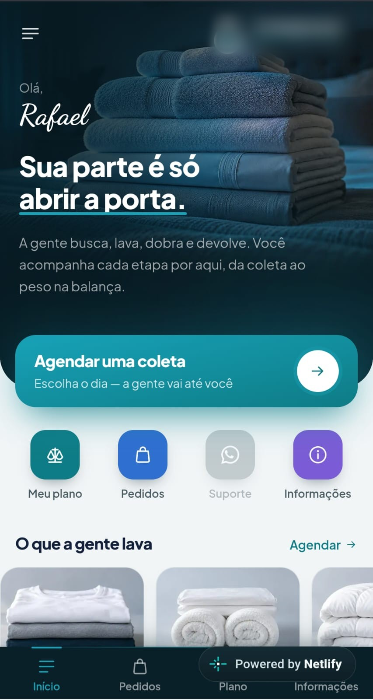
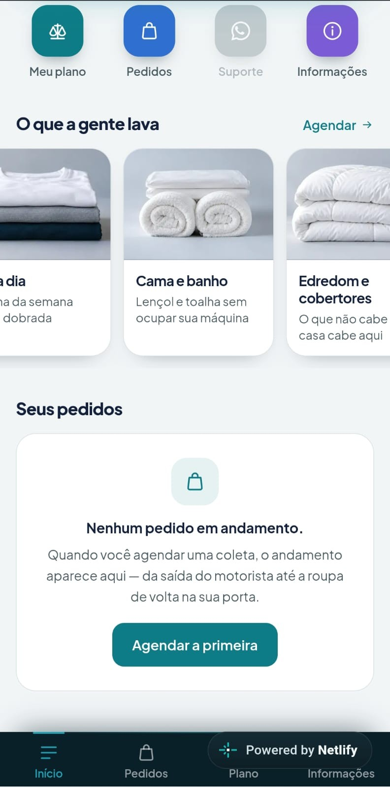
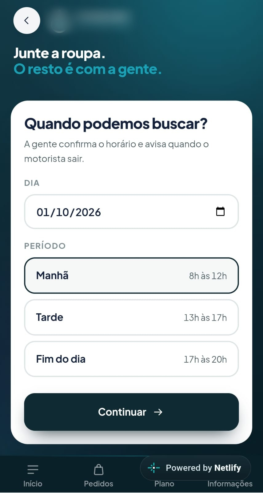
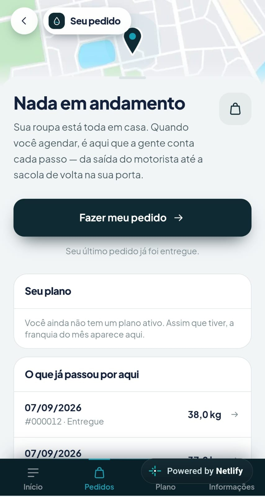
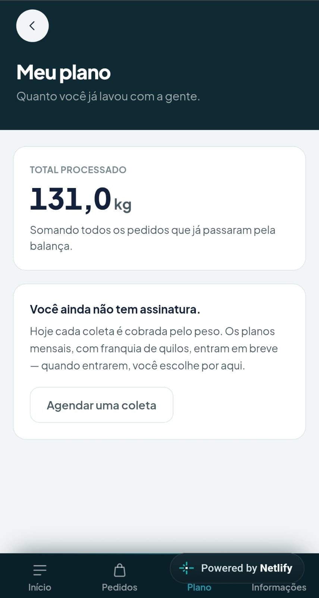

# 🧺 Plataforma de lavanderia por assinatura

> **Projeto real em desenvolvimento.** Nome, marca e dados do negócio foram omitidos por confidencialidade.
> Este repositório é uma **vitrine**: mostra o produto e as decisões por trás dele, sem o código-fonte.

Plataforma para uma lavanderia por assinatura com **coleta e entrega em casa**: o cliente agenda, o motorista busca, a unidade pesa, lava e devolve, e cada etapa fica registrada.

**Meu papel:** Product Owner e desenvolvimento, com agentes de IA (Claude Code) escrevendo o código sob a minha especificação.

---

## 📱 Telas do app do cliente

<table>
  <tr>
    <td></td>
    <td></td>
    <td></td>
    <td></td>
    <td></td>
  </tr>
  <tr>
    <td align="center">Início</td>
    <td align="center">Serviços</td>
    <td align="center">Agendar coleta</td>
    <td align="center">Pedidos</td>
    <td align="center">Plano</td>
  </tr>
</table>

---

## 🎯 Decisões de produto

O código foi a parte rápida. O trabalho de verdade foi decidir **o que construir, para quem e em que ordem**.

### 1. Roadmap em 5 fases

```
Fase 1   backoffice + operação
Fase 2   app do cliente
Fase 3   automações e integrações
Fase 4   B2B avançado
Fase 5   expansão multiunidade
```

### 2. MVP scope: o app do cliente ficou **fora** da v1

Na Fase 1 o cliente pede por WhatsApp e o operador lança o pedido no painel.
O app entra depois, **como conveniência, não como pré-requisito para operar**.

Primeiro validar a operação com os primeiros clientes. Depois construir a conveniência.

### 3. Priorização do backlog

| Prioridade | Critério |
|---|---|
| **P0** | Sem isso a lavanderia não opera |
| **P1** | Entra logo depois, ainda na Fase 1 |
| **P2** | Quando a operação estabilizar |

A tela principal do operador não é um dashboard de indicadores: é uma **fila de trabalho** (coletas de hoje, entregas de hoje, em processamento, aguardando pesagem).

### 4. User personas: 8 papéis

Administrador, gestor da unidade, operador, controle de qualidade, motorista, financeiro, cliente residencial e cliente B2B.
Uma mesma pessoa pode acumular papéis, e cada papel só enxerga o que precisa.

### 5. Fluxo do pedido, ponta a ponta

```
solicitar → confirmar → rota → coletar → receber → pesar → triagem
→ lavar → secar → controle de qualidade → dobrar → expedir → entregar → concluir
```

São 14 etapas, e cada transição grava **quem fez, quando e em qual unidade**.

### 6. Discovery com o stakeholder

Antes de escrever a especificação, levantei **21 perguntas de negócio** com o sócio da operação (preço, franquia de quilos, prazos, papéis, cobrança de excedente). As respostas viraram o documento de decisões que guia o produto.

---

## 🛠️ Stack

| Camada | Tecnologia |
|---|---|
| Web (painel e app) | Next.js 16 · React 19 · TypeScript |
| Banco, autenticação, storage | Supabase (PostgreSQL) |
| App Android | Capacitor |
| Deploy contínuo (CD) | GitHub + Netlify |
| Integração contínua (CI) | GitHub Actions |

---

## 🔒 Qualidade e segurança

Regras definidas antes da primeira tela:

- **Isolamento entre unidades** feito dentro do banco (Row Level Security), nunca pelo aplicativo
- **Toda tabela com política de acesso.** O CI falha se aparecer uma tabela sem proteção
- **Nenhuma chave no repositório**
- **Financeiro imutável:** correção é sempre um lançamento novo
- **Auditoria com antes e depois** em pesagem, status, cobrança e ocorrências
- **Nada fixo no código:** preço, franquia e prazos são parâmetros de cada unidade

**Pipeline de CI:** a cada mudança no banco, o GitHub Actions sobe um PostgreSQL, aplica todas as migrations e roda os testes de proteção e de isolamento entre unidades.

---

## 📊 Números do projeto

| | |
|---|---|
| Telas | 33 |
| Áreas | 3 (cliente, operador, motorista) |
| Migrations do banco | 30 |
| Papéis de acesso | 8 |
| Etapas do fluxo do pedido | 14 |

---

## 📄 Documentos que guiam o projeto

- Especificação funcional
- Modelo de dados
- Decisões de negócio (respostas do stakeholder)
- Regras de segurança e LGPD
- Plano de operação

---

Feito por **Rafael Sisti** · [LinkedIn](https://www.linkedin.com/in/rafaelhsn) · [GitHub](https://github.com/Rafasix)
